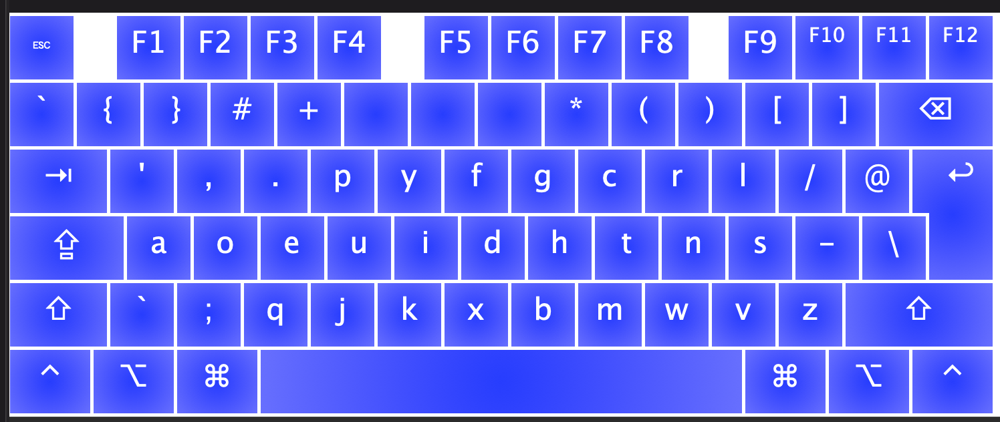
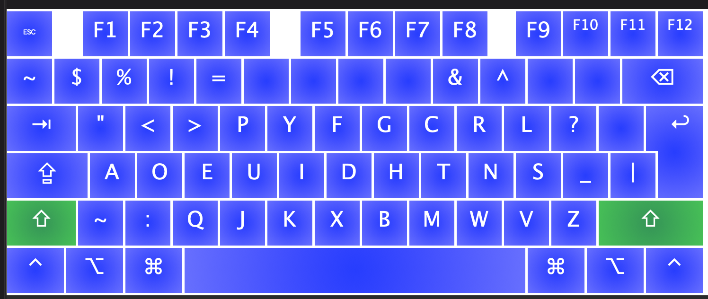

# ¿Qué es esto
- this is my partially custom keyboard layout for my M1 mac
- mostly it is the symbols and numbers which have been customised
	- the numbers can be accessed in a numpad by holding down the tab key (or numpad can be activated by tapping the ctrl key solo)
	- the special characters have almost all been moved for ergonomic purposes
	
The normal layout can be visualised as:

The layout with the shift-button held looks like:

